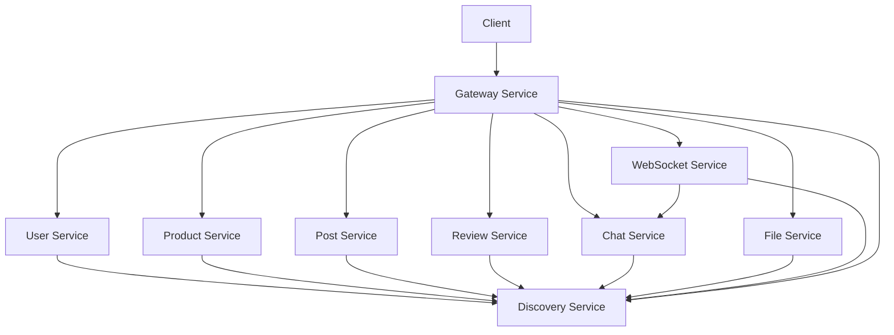

# Momnect Backend

> **Momnect** 중고 육아용품 거래 플랫폼의 백엔드 마이크로서비스 아키텍처입니다.

Spring Boot 3.4.8과 Spring Cloud를 기반으로 한 마이크로서비스 아키텍처로, 확장 가능하고 유지보수가 용이한 시스템을 제공합니다.

## 🚀 기술 스택

### Core Framework

- **Framework**: Spring Boot 3.4.8
- **Language**: Java 17
- **Build Tool**: Gradle 8.x
- **Spring Cloud**: 2024.0.2

### Microservices Architecture

- **Service Discovery**: Netflix Eureka
- **API Gateway**: Spring Cloud Gateway
- **Load Balancing**: Spring Cloud LoadBalancer
- **Service Communication**: OpenFeign

### Database & Search

- **Primary Database**: MySQL 8.0
- **Search Engine**: Elasticsearch 8.15.0
- **ORM**: Spring Data JPA / Hibernate
- **Connection Pool**: HikariCP

### Security & Authentication

- **Security**: Spring Security 6.x
- **JWT**: JSON Web Token (jjwt 0.12.6)
- **Password Encoding**: BCrypt

### Real-time Communication

- **WebSocket**: Spring WebSocket
- **STOMP**: Simple Text Oriented Messaging Protocol
- **SockJS**: WebSocket fallback

### File Management

- **File Storage**: Local Storage / AWS S3 (선택사항)
- **File Processing**: Apache POI (Excel 처리)

### Documentation & Testing

- **API Documentation**: Swagger/OpenAPI 3
- **Testing**: JUnit 5, Spring Boot Test
- **Code Quality**: Lombok

## 📁 프로젝트 구조

```
BE09-Final-2team-BE/
├── discovery-service/           # 서비스 디스커버리 (Eureka Server)
│   ├── src/main/java/
│   │   └── com/momnect/discoveryservice/
│   │       └── DiscoveryServiceApplication.java
│   ├── src/main/resources/
│   │   └── application.yml
│   ├── build.gradle
│   └── Dockerfile
│
├── gateway-service/             # API 게이트웨이
│   ├── src/main/java/
│   │   └── com/momnect/gatewayservice/
│   │       ├── config/         # 게이트웨이 설정
│   │       ├── filter/         # 필터 (JWT, CORS 등)
│   │       └── GatewayServiceApplication.java
│   ├── src/main/resources/
│   │   └── application.yml
│   ├── build.gradle
│   └── Dockerfile
│
├── user-service/                # 사용자 관리 서비스
│   ├── src/main/java/
│   │   └── com/momnect/userservice/
│   │       ├── controller/     # REST 컨트롤러
│   │       ├── service/        # 비즈니스 로직
│   │       ├── repository/     # 데이터 접근 계층
│   │       ├── entity/         # JPA 엔티티
│   │       ├── dto/           # 데이터 전송 객체
│   │       ├── config/        # 설정 클래스
│   │       ├── security/      # 보안 설정
│   │       └── UserServiceApplication.java
│   ├── src/main/resources/
│   │   └── application.yml
│   ├── build.gradle
│   └── Dockerfile
│
├── product-service/             # 상품 관리 서비스
│   ├── src/main/java/
│   │   └── com/momnect/productservice/
│   │       ├── controller/
│   │       ├── service/
│   │       ├── repository/
│   │       ├── entity/
│   │       ├── dto/
│   │       ├── config/
│   │       ├── elasticsearch/  # Elasticsearch 설정
│   │       └── ProductServiceApplication.java
│   ├── src/main/resources/
│   │   ├── application.yml
│   │   └── data.sql           # 초기 데이터
│   ├── build.gradle
│   └── Dockerfile
│
├── post-service/                # 게시판 서비스
│   ├── src/main/java/
│   │   └── com/momnect/postservice/
│   │       ├── controller/
│   │       ├── service/
│   │       ├── repository/
│   │       ├── entity/
│   │       ├── dto/
│   │       └── PostServiceApplication.java
│   ├── src/main/resources/
│   │   └── application.yml
│   ├── build.gradle
│   └── Dockerfile
│
├── review-service/              # 리뷰 서비스
│   ├── src/main/java/
│   │   └── com/momnect/reviewservice/
│   │       ├── controller/
│   │       ├── service/
│   │       ├── repository/
│   │       ├── entity/
│   │       ├── dto/
│   │       └── ReviewServiceApplication.java
│   ├── src/main/resources/
│   │   └── application.yml
│   ├── build.gradle
│   └── Dockerfile
│
├── chat-service/                # 채팅 메시지 서비스
│   ├── src/main/java/
│   │   └── com/momnect/chatservice/
│   │       ├── controller/
│   │       ├── service/
│   │       ├── repository/
│   │       ├── entity/
│   │       ├── dto/
│   │       └── ChatServiceApplication.java
│   ├── src/main/resources/
│   │   └── application.yml
│   ├── build.gradle
│   └── Dockerfile
│
├── websocket-service/           # WebSocket 서비스
│   ├── src/main/java/
│   │   └── com/momnect/websocketservice/
│   │       ├── config/        # WebSocket 설정
│   │       ├── controller/    # STOMP 엔드포인트
│   │       ├── service/       # 메시지 처리
│   │       ├── listener/      # 이벤트 리스너
│   │       └── WebSocketServiceApplication.java
│   ├── src/main/resources/
│   │   └── application.yml
│   ├── build.gradle
│   └── Dockerfile
│
├── file-service/                # 파일 관리 서비스
│   ├── src/main/java/
│   │   └── com/momnect/fileservice/
│   │       ├── controller/
│   │       ├── service/
│   │       ├── config/
│   │       └── FileServiceApplication.java
│   ├── src/main/resources/
│   │   └── application.yml
│   ├── build.gradle
│   └── Dockerfile
│
├── open-ai-service/             # AI 서비스 (개발 중)
│   ├── src/main/java/
│   │   └── com/momnect/openaiservice/
│   └── src/main/resources/
│       └── application.yml
│
├── _k8s/                        # Kubernetes 배포 설정
│   ├── discovery-service.yaml
│   ├── gateway-service.yaml
│   ├── user-service.yaml
│   ├── product-service.yaml
│   ├── post-service.yaml
│   ├── review-service.yaml
│   ├── chat-service.yaml
│   ├── websocket-service.yaml
│   └── file-service.yaml
│
├── Jenkinsfile                  # CI/CD 파이프라인
├── docker-compose.yml           # 로컬 개발용 Docker Compose
└── README.md                    # 프로젝트 문서
```

## 🏗️ 마이크로서비스 아키텍처

### 서비스별 역할

| 서비스                | 포트 | 주요 기능                    | 데이터베이스         |
| --------------------- | ---- | ---------------------------- | -------------------- |
| **Discovery Service** | 8761 | 서비스 디스커버리, 헬스체크  | -                    |
| **Gateway Service**   | 8000 | API 라우팅, 인증, 로드밸런싱 | -                    |
| **User Service**      | 0\*  | 사용자 관리, 인증, 프로필    | MySQL                |
| **Product Service**   | 0\*  | 상품 CRUD, 검색, 카테고리    | MySQL, Elasticsearch |
| **Post Service**      | 0\*  | 게시판, 댓글, 좋아요         | MySQL                |
| **Review Service**    | 0\*  | 리뷰 작성, 평점 관리         | MySQL                |
| **Chat Service**      | 0\*  | 채팅 메시지 저장, 히스토리   | MySQL                |
| **WebSocket Service** | 0\*  | 실시간 메시징, STOMP         | -                    |
| **File Service**      | 0\*  | 파일 업로드, 이미지 처리     | -                    |

\*포트 0: Eureka를 통한 동적 포트 할당

### 서비스 간 통신



## 🛠️ 설치 및 실행

### 사전 요구사항

- **Java**: 17 이상
- **Gradle**: 8.x
- **MySQL**: 8.0 이상
- **Elasticsearch**: 8.15.0 이상
- **Docker**: 20.10 이상 (선택사항)

### 1. 데이터베이스 설정

#### MySQL 설정

```sql
-- 데이터베이스 생성 (환경변수로 설정된 데이터베이스)
CREATE DATABASE momnect_user;
CREATE DATABASE momnect_product;
CREATE DATABASE momnect_post;
CREATE DATABASE momnect_review;
CREATE DATABASE momnect_chat;

-- 사용자 생성 및 권한 부여
CREATE USER 'momnect'@'%' IDENTIFIED BY 'password';
GRANT ALL PRIVILEGES ON momnect_*.* TO 'momnect'@'%';
FLUSH PRIVILEGES;
```

**환경변수 설정:**

```bash
# .env 파일 또는 환경변수로 설정
DB_URL=jdbc:mysql://localhost:3306/momnect_user
DB_USER=momnect
DB_PASS=password
DEFAULT_ZONE=http://localhost:8761/eureka
JWT_SECRET=your-jwt-secret-key
FTP_SERVER_URL=your-ftp-server-url
```

#### Elasticsearch 설정

```yaml
# elasticsearch.yml
cluster.name: momnect-cluster
node.name: momnect-node-1
network.host: 0.0.0.0
http.port: 9200
discovery.type: single-node
```

### 2. 환경 변수 설정

각 서비스는 환경변수를 통해 데이터베이스 연결 정보를 설정합니다:

```yaml
# application.yml 예시 (user-service)
spring:
  datasource:
    driver-class-name: com.mysql.cj.jdbc.Driver
    url: ${DB_URL}
    username: ${DB_USER}
    password: ${DB_PASS}
```

**필수 환경변수:**

- `DB_URL`: 데이터베이스 연결 URL
- `DB_USER`: 데이터베이스 사용자명
- `DB_PASS`: 데이터베이스 비밀번호
- `DEFAULT_ZONE`: Eureka 서버 URL
- `JWT_SECRET`: JWT 토큰 시크릿 키
- `FTP_SERVER_URL`: FTP 서버 URL (파일 서비스용)

### 3. 서비스 실행

#### 개별 서비스 실행

```bash
# Discovery Service (먼저 실행)
cd discovery-service
./gradlew bootRun

# Gateway Service
cd ../gateway-service
./gradlew bootRun

# User Service
cd ../user-service
./gradlew bootRun

# Product Service
cd ../product-service
./gradlew bootRun

# 기타 서비스들도 동일한 방식으로 실행
```

#### Docker Compose로 실행 (권장)

```bash
# 모든 서비스와 데이터베이스를 함께 실행
docker-compose up -d
```

### 4. 서비스 확인

- **Discovery Service**: http://localhost:8761
- **Gateway Service**: http://localhost:8000
- **Swagger UI**: http://localhost:8000/swagger-ui.html
- **각 서비스별 Swagger**: Gateway를 통해 접근 (포트는 동적 할당)

**Eureka Dashboard에서 실제 포트 확인:**

- http://localhost:8761 에서 등록된 서비스들의 실제 포트 확인 가능

**Gateway 라우팅 정보:**

- 모든 API 요청은 Gateway(8000)를 통해 라우팅됩니다
- API 경로: `/api/v1/{service-name}/**`
- WebSocket: `/ws-stomp/**` (STOMP 프로토콜)

## 🔧 개발 가이드

### 1. 새로운 서비스 추가

```bash
# 새 서비스 디렉토리 생성
mkdir new-service
cd new-service

# Gradle 프로젝트 초기화
gradle init --type java-application

# build.gradle 설정
# application.yml 설정
# 메인 클래스 생성
```

### 2. API 개발 패턴

#### Controller 예시

```java
@RestController
@RequestMapping("/api/users")
@RequiredArgsConstructor
@Slf4j
public class UserController {

    private final UserService userService;

    @GetMapping("/{id}")
    public ResponseEntity<UserResponseDto> getUser(@PathVariable Long id) {
        UserResponseDto user = userService.getUser(id);
        return ResponseEntity.ok(user);
    }

    @PostMapping
    public ResponseEntity<UserResponseDto> createUser(@RequestBody @Valid UserRequestDto request) {
        UserResponseDto user = userService.createUser(request);
        return ResponseEntity.status(HttpStatus.CREATED).body(user);
    }
}
```

#### Service 예시

```java
@Service
@RequiredArgsConstructor
@Transactional(readOnly = true)
@Slf4j
public class UserService {

    private final UserRepository userRepository;
    private final ModelMapper modelMapper;

    public UserResponseDto getUser(Long id) {
        User user = userRepository.findById(id)
            .orElseThrow(() -> new UserNotFoundException("사용자를 찾을 수 없습니다."));
        return modelMapper.map(user, UserResponseDto.class);
    }

    @Transactional
    public UserResponseDto createUser(UserRequestDto request) {
        User user = modelMapper.map(request, User.class);
        User savedUser = userRepository.save(user);
        return modelMapper.map(savedUser, UserResponseDto.class);
    }
}
```

### 3. 데이터베이스 설정

#### JPA Entity 예시

```java
@Entity
@Table(name = "users")
@Getter
@NoArgsConstructor
@AllArgsConstructor
@Builder
public class User {

    @Id
    @GeneratedValue(strategy = GenerationType.IDENTITY)
    private Long id;

    @Column(unique = true, nullable = false)
    private String email;

    @Column(nullable = false)
    private String password;

    @Column(nullable = false)
    private String name;

    @Enumerated(EnumType.STRING)
    private UserRole role;

    @CreationTimestamp
    private LocalDateTime createdAt;

    @UpdateTimestamp
    private LocalDateTime updatedAt;
}
```

#### Repository 예시

```java
@Repository
public interface UserRepository extends JpaRepository<User, Long> {

    Optional<User> findByEmail(String email);

    boolean existsByEmail(String email);

    @Query("SELECT u FROM User u WHERE u.role = :role")
    List<User> findByRole(@Param("role") UserRole role);
}
```

### 4. 서비스 간 통신 (OpenFeign)

#### Feign Client 예시

```java
@FeignClient(name = "user-service")
public interface UserServiceClient {

    @GetMapping("/api/users/{id}")
    UserResponseDto getUser(@PathVariable("id") Long id);

    @PostMapping("/api/users")
    UserResponseDto createUser(@RequestBody UserRequestDto request);
}
```

### 5. WebSocket 설정

#### WebSocket Configuration

```java
@Configuration
@EnableWebSocketMessageBroker
public class WebSocketConfig implements WebSocketMessageBrokerConfigurer {

    @Override
    public void configureMessageBroker(MessageBrokerRegistry config) {
        config.enableSimpleBroker("/topic");
        config.setApplicationDestinationPrefixes("/app");
    }

    @Override
    public void registerStompEndpoints(StompEndpointRegistry registry) {
        registry.addEndpoint("/ws")
                .setAllowedOriginPatterns("*")
                .withSockJS();
    }
}
```

#### STOMP Controller

```java
@Controller
@RequiredArgsConstructor
@Slf4j
public class ChatController {

    @MessageMapping("/chat.send")
    @SendTo("/topic/chat")
    public ChatMessage sendMessage(@Payload ChatMessage chatMessage) {
        log.info("Received message: {}", chatMessage);
        return chatMessage;
    }
}
```

## 🔒 보안 설정

### JWT 설정

```java
@Configuration
@EnableWebSecurity
@RequiredArgsConstructor
public class SecurityConfig {

    private final JwtAuthenticationEntryPoint jwtAuthenticationEntryPoint;
    private final JwtRequestFilter jwtRequestFilter;

    @Bean
    public SecurityFilterChain filterChain(HttpSecurity http) throws Exception {
        http.csrf().disable()
            .authorizeHttpRequests(authz -> authz
                .requestMatchers("/api/auth/**").permitAll()
                .requestMatchers("/swagger-ui/**").permitAll()
                .requestMatchers("/v3/api-docs/**").permitAll()
                .anyRequest().authenticated()
            )
            .exceptionHandling().authenticationEntryPoint(jwtAuthenticationEntryPoint)
            .and()
            .sessionManagement().sessionCreationPolicy(SessionCreationPolicy.STATELESS);

        http.addFilterBefore(jwtRequestFilter, UsernamePasswordAuthenticationFilter.class);
        return http.build();
    }
}
```

## 🚀 배포

### Docker 배포

```bash
# 개별 서비스 빌드
cd user-service
docker build -t momnect/user-service:latest .

# 모든 서비스 빌드
./build-all.sh
```

### Kubernetes 배포

```bash
# 네임스페이스 생성
kubectl create namespace momnect

# 시크릿 생성
kubectl create secret generic app-secret --from-env-file=.env -n momnect

# 서비스 배포
kubectl apply -f _k8s/ -n momnect

# 배포 상태 확인
kubectl get pods -n momnect
```

### Jenkins CI/CD

```groovy
pipeline {
    agent any
    stages {
        stage('Build') {
            steps {
                sh './gradlew clean build'
            }
        }
        stage('Docker Build') {
            steps {
                sh 'docker build -t momnect/${SERVICE_NAME}:latest .'
            }
        }
        stage('Deploy') {
            steps {
                sh 'kubectl rollout restart deployment/${SERVICE_NAME} -n momnect'
            }
        }
    }
}
```

## 🔧 트러블슈팅

### 자주 발생하는 문제

1. **서비스 디스커버리 실패**

   - Eureka 서버가 먼저 실행되었는지 확인
   - 네트워크 연결 상태 확인

2. **데이터베이스 연결 오류**

   - MySQL 서버 상태 확인
   - 연결 정보 (URL, 사용자명, 비밀번호) 확인

3. **JWT 토큰 오류**

   - 토큰 만료 시간 확인
   - 시크릿 키 일치 여부 확인

4. **WebSocket 연결 실패**
   - CORS 설정 확인
   - STOMP 엔드포인트 설정 확인

---

## 🔗 관련 링크

- [Spring Boot 공식 문서](https://spring.io/projects/spring-boot)
- [Spring Cloud 공식 문서](https://spring.io/projects/spring-cloud)
- [Spring Security 문서](https://spring.io/projects/spring-security)
- [MySQL 공식 문서](https://dev.mysql.com/doc/)
- [Elasticsearch 공식 문서](https://www.elastic.co/guide/)
- [Docker 공식 문서](https://docs.docker.com/)
- [Kubernetes 공식 문서](https://kubernetes.io/docs/)

## 📄 라이선스

이 프로젝트는 비공개 프로젝트입니다.

---

**Momnect Backend** - 확장 가능한 마이크로서비스 아키텍처 🏗️⚙️
