# Momnect Backend

> **Momnect** 중고 육아용품 거래 플랫폼의 백엔드 마이크로서비스 아키텍처입니다.

Spring Boot 3.4.8과 Spring Cloud를 기반으로 한 마이크로서비스 아키텍처로, 확장 가능하고 유지보수가 용이한 시스템을 제공합니다.

## 🚀 기술 스택

### Core Framework

- **Framework**: Spring Boot 3.4.8
- **Language**: Java 17
- **Build Tool**: Gradle 8.x
- **Spring Cloud**: 2024.0.2

### Microservices Architecture

- **Service Discovery**: Netflix Eureka
- **API Gateway**: Spring Cloud Gateway
- **Load Balancing**: Spring Cloud LoadBalancer
- **Service Communication**: OpenFeign

### Database & Search

- **Primary Database**: MySQL 8.0
- **Search Engine**: Elasticsearch 8.15.0
- **ORM**: Spring Data JPA / Hibernate
- **Connection Pool**: HikariCP

### Security & Authentication

- **Security**: Spring Security 6.x
- **JWT**: JSON Web Token (jjwt 0.12.6)
- **Password Encoding**: BCrypt

### Real-time Communication

- **WebSocket**: Spring WebSocket
- **STOMP**: Simple Text Oriented Messaging Protocol
- **SockJS**: WebSocket fallback

### File Management

- **File Storage**: Local Storage / AWS S3 (선택사항)
- **File Processing**: Apache POI (Excel 처리)

### Documentation & Testing

- **API Documentation**: Swagger/OpenAPI 3
- **Testing**: JUnit 5, Spring Boot Test
- **Code Quality**: Lombok

## 📁 프로젝트 구조

```
BE09-Final-2team-BE/
├── discovery-service/           # 서비스 디스커버리 (Eureka Server)
│   ├── src/main/java/
│   │   └── com/momnect/discoveryservice/
│   │       └── DiscoveryServiceApplication.java
│   ├── src/main/resources/
│   │   └── application.yml
│   ├── build.gradle
│   └── Dockerfile
│
├── gateway-service/             # API 게이트웨이
│   ├── src/main/java/
│   │   └── com/momnect/gatewayservice/
│   │       ├── config/         # 게이트웨이 설정
│   │       ├── filter/         # 필터 (JWT, CORS 등)
│   │       └── GatewayServiceApplication.java
│   ├── src/main/resources/
│   │   └── application.yml
│   ├── build.gradle
│   └── Dockerfile
│
├── user-service/                # 사용자 관리 서비스
│   ├── src/main/java/
│   │   └── com/momnect/userservice/
│   │       ├── controller/     # REST 컨트롤러
│   │       ├── service/        # 비즈니스 로직
│   │       ├── repository/     # 데이터 접근 계층
│   │       ├── entity/         # JPA 엔티티
│   │       ├── dto/           # 데이터 전송 객체
│   │       ├── config/        # 설정 클래스
│   │       ├── security/      # 보안 설정
│   │       └── UserServiceApplication.java
│   ├── src/main/resources/
│   │   └── application.yml
│   ├── build.gradle
│   └── Dockerfile
│
├── product-service/             # 상품 관리 서비스
│   ├── src/main/java/
│   │   └── com/momnect/productservice/
│   │       ├── controller/
│   │       ├── service/
│   │       ├── repository/
│   │       ├── entity/
│   │       ├── dto/
│   │       ├── config/
│   │       ├── elasticsearch/  # Elasticsearch 설정
│   │       └── ProductServiceApplication.java
│   ├── src/main/resources/
│   │   ├── application.yml
│   │   └── data.sql           # 초기 데이터
│   ├── build.gradle
│   └── Dockerfile
│
├── post-service/                # 게시판 서비스
│   ├── src/main/java/
│   │   └── com/momnect/postservice/
│   │       ├── controller/
│   │       ├── service/
│   │       ├── repository/
│   │       ├── entity/
│   │       ├── dto/
│   │       └── PostServiceApplication.java
│   ├── src/main/resources/
│   │   └── application.yml
│   ├── build.gradle
│   └── Dockerfile
│
├── review-service/              # 리뷰 서비스
│   ├── src/main/java/
│   │   └── com/momnect/reviewservice/
│   │       ├── controller/
│   │       ├── service/
│   │       ├── repository/
│   │       ├── entity/
│   │       ├── dto/
│   │       └── ReviewServiceApplication.java
│   ├── src/main/resources/
│   │   └── application.yml
│   ├── build.gradle
│   └── Dockerfile
│
├── chat-service/                # 채팅 메시지 서비스
│   ├── src/main/java/
│   │   └── com/momnect/chatservice/
│   │       ├── controller/
│   │       ├── service/
│   │       ├── repository/
│   │       ├── entity/
│   │       ├── dto/
│   │       └── ChatServiceApplication.java
│   ├── src/main/resources/
│   │   └── application.yml
│   ├── build.gradle
│   └── Dockerfile
│
├── websocket-service/           # WebSocket 서비스
│   ├── src/main/java/
│   │   └── com/momnect/websocketservice/
│   │       ├── config/        # WebSocket 설정
│   │       ├── controller/    # STOMP 엔드포인트
│   │       ├── service/       # 메시지 처리
│   │       ├── listener/      # 이벤트 리스너
│   │       └── WebSocketServiceApplication.java
│   ├── src/main/resources/
│   │   └── application.yml
│   ├── build.gradle
│   └── Dockerfile
│
├── file-service/                # 파일 관리 서비스
│   ├── src/main/java/
│   │   └── com/momnect/fileservice/
│   │       ├── controller/
│   │       ├── service/
│   │       ├── config/
│   │       └── FileServiceApplication.java
│   ├── src/main/resources/
│   │   └── application.yml
│   ├── build.gradle
│   └── Dockerfile
│
├── open-ai-service/             # AI 서비스 (개발 중)
│   ├── src/main/java/
│   │   └── com/momnect/openaiservice/
│   └── src/main/resources/
│       └── application.yml
│
├── _k8s/                        # Kubernetes 배포 설정
│   ├── discovery-service.yaml
│   ├── gateway-service.yaml
│   ├── user-service.yaml
│   ├── product-service.yaml
│   ├── post-service.yaml
│   ├── review-service.yaml
│   ├── chat-service.yaml
│   ├── websocket-service.yaml
│   └── file-service.yaml
│
├── Jenkinsfile                  # CI/CD 파이프라인
├── docker-compose.yml           # 로컬 개발용 Docker Compose
└── README.md                    # 프로젝트 문서
```

## 🏗️ 마이크로서비스 아키텍처

### 서비스별 역할

| 서비스                | 포트 | 주요 기능                    | 데이터베이스         |
| --------------------- | ---- | ---------------------------- | -------------------- |
| **Discovery Service** | 8761 | 서비스 디스커버리, 헬스체크  | -                    |
| **Gateway Service**   | 8000 | API 라우팅, 인증, 로드밸런싱 | -                    |
| **User Service**      | 0\*  | 사용자 관리, 인증, 프로필    | MySQL                |
| **Product Service**   | 0\*  | 상품 CRUD, 검색, 카테고리    | MySQL, Elasticsearch |
| **Post Service**      | 0\*  | 게시판, 댓글, 좋아요         | MySQL                |
| **Review Service**    | 0\*  | 리뷰 작성, 평점 관리         | MySQL                |
| **Chat Service**      | 0\*  | 채팅 메시지 저장, 히스토리   | MySQL                |
| **WebSocket Service** | 0\*  | 실시간 메시징, STOMP         | -                    |
| **File Service**      | 0\*  | 파일 업로드, 이미지 처리     | -                    |

\*포트 0: Eureka를 통한 동적 포트 할당

### 서비스 간 통신



## 🚀 배포

### Docker 배포

```bash
# 개별 서비스 빌드
cd user-service
docker build -t momnect/user-service:latest .

# 모든 서비스 빌드
./build-all.sh
```

### Kubernetes 배포

```bash
# 네임스페이스 생성
kubectl create namespace momnect

# 시크릿 생성
kubectl create secret generic app-secret --from-env-file=.env -n momnect

# 서비스 배포
kubectl apply -f _k8s/ -n momnect

# 배포 상태 확인
kubectl get pods -n momnect
```

### Jenkins CI/CD

- deploy 브랜치에 push 시 jenkins를 통한 CI/CD 구현

## 🔧 트러블슈팅

### 자주 발생하는 문제

1. **서비스 디스커버리 실패**

   - Eureka 서버가 먼저 실행되었는지 확인
   - 네트워크 연결 상태 확인

2. **데이터베이스 연결 오류**

   - MySQL 서버 상태 확인
   - 연결 정보 (URL, 사용자명, 비밀번호) 확인

3. **JWT 토큰 오류**

   - 토큰 만료 시간 확인
   - 시크릿 키 일치 여부 확인

4. **WebSocket 연결 실패**
   - CORS 설정 확인
   - STOMP 엔드포인트 설정 확인

---

## 🔗 관련 링크

- [Spring Boot 공식 문서](https://spring.io/projects/spring-boot)
- [Spring Cloud 공식 문서](https://spring.io/projects/spring-cloud)
- [Spring Security 문서](https://spring.io/projects/spring-security)
- [MySQL 공식 문서](https://dev.mysql.com/doc/)
- [Elasticsearch 공식 문서](https://www.elastic.co/guide/)
- [Docker 공식 문서](https://docs.docker.com/)
- [Kubernetes 공식 문서](https://kubernetes.io/docs/)

## 📄 라이선스

이 프로젝트는 비공개 프로젝트입니다.

---

**Momnect Backend** - 확장 가능한 마이크로서비스 아키텍처 🏗️⚙️
